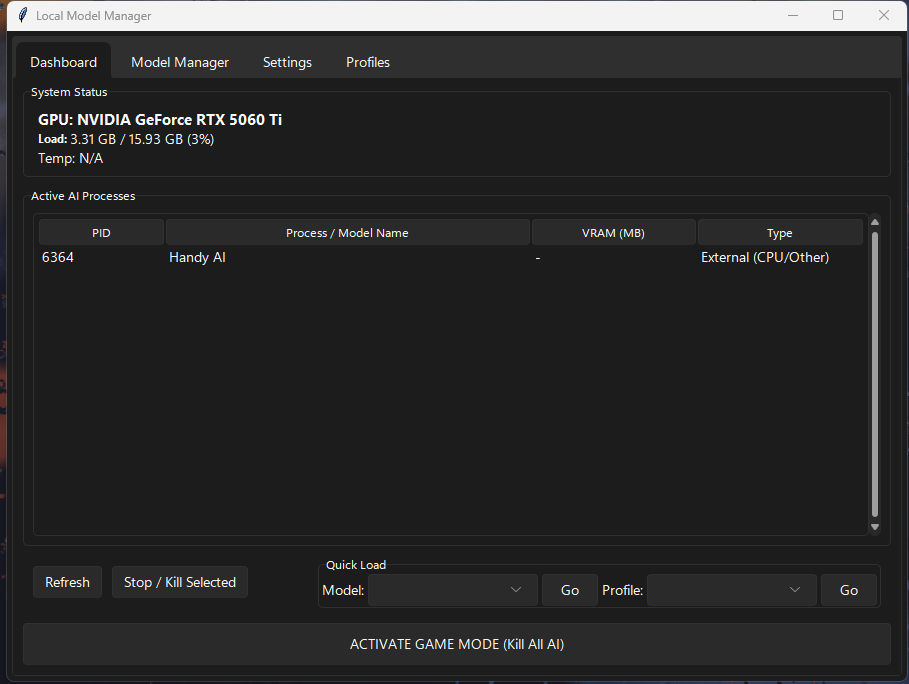
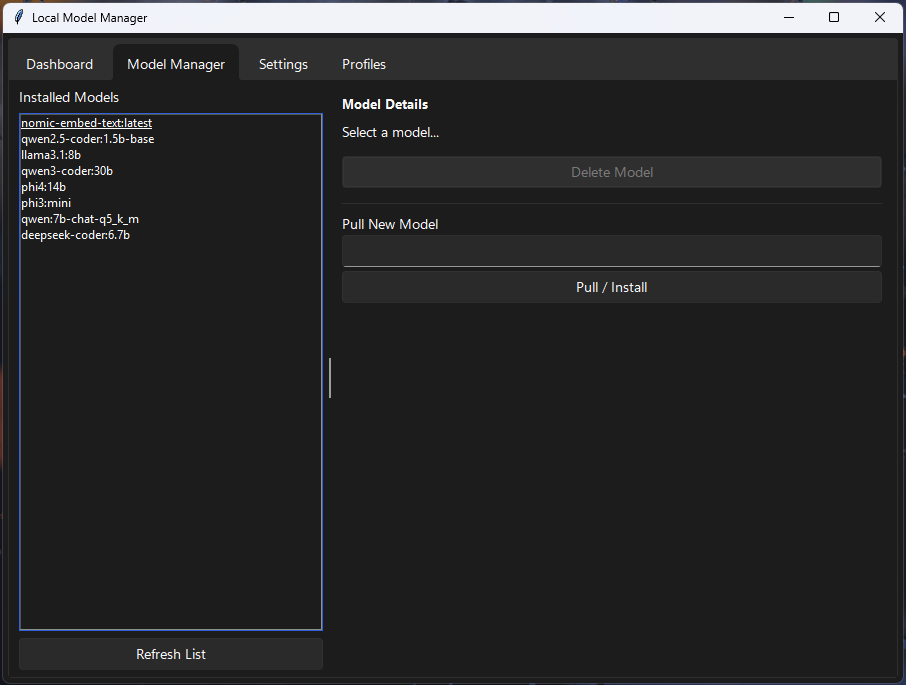
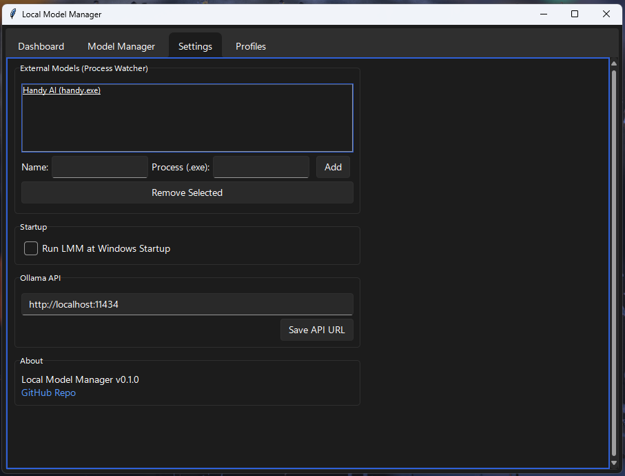
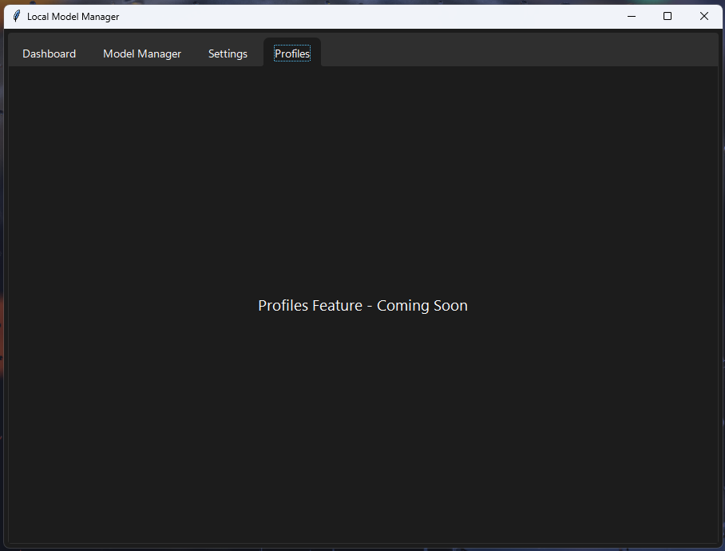
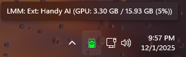
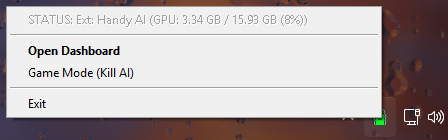

# LMM - Local Model Manager

> **⚠️ AI Architecture Disclaimer:** This project is a "Vibe Code" fork, architected and co-developed by **Gemini (Google)** under the vision of **Allie (allie-rae-devop)**. It represents a "human-in-the-loop" development process.
>
> **Attribution:** Built upon the foundation of `ollama-monitor` by **Yusuf Emre ALBAYRAK**.



**LMM** is a power-user tool for managing local AI resources on Windows. It goes beyond simple API monitoring to track raw VRAM usage, monitor external AI processes (like Handy AI or Python scripts), and provides a "Game Mode" to instantly free up GPU resources. The need of this fork came from the fact that every tool I had found up to that point did not have easy ways to manage models via a singular GUI. The options were either very limited monitoring applications, like the original source of this fork or were extremely hardcoded to only OLLAMA or CLI based stats. I wanted something GUI based that could create profiles of multiple models, load and unload those profiles or individual models with a single button click, add new models from a drop down menu, or uninstall models. I'm sure if I tried hard enough I would find this tool somewhere, but I found a good starting point and built from there. Hopefully someone else finds this tool helpful. I have plans for features to come and more integrations for secondary AI agent and/or software based agents to be added outside of Ollama like Handy AI voice to text agent https://handy.computer/ A template is in the works so other people can either do a pull request and add those agents themself to this project, or you can submit a request and I will do my best to get that software based agent integrated. As the logic works now, it's using Windows task manager to essentially watch for the .exe of any software based agent you set up to be monitored by watching the GPU usage statistics.

## ✨ Features

*   **👁️ Monitor Everything:** Tracks NVIDIA VRAM usage directly using `nvidia-ml-py`. Detects *any* AI model loading your GPU (Ollama, Handy, Python scripts), not just what the Ollama API reports.
*   **Unified Dashboard:** A modern, dark-mode GUI (using `sv_ttk`) to view GPU stats, active processes, and manage models.
*   **🎮 Game Mode:** The "Nuclear Option". Instantly terminate AI processes (`ollama_llama_server.exe`, `python.exe`, `handy.exe`) via the System Tray or Dashboard to reclaim VRAM for gaming.
*   **📦 Model Manager:** List, Pull (install), and Delete Ollama models via a GUI.
*   **Process Watcher:** Configure custom executables to track in the dashboard (e.g., "MyCustomAgent.exe").

## 📸 Visual Tour

| Dashboard | Model Manager |
| :---: | :---: |
|  |  |
| **Settings** | **Profiles (WIP)** |
|  |  |

### System Tray States

| Idle | Hover | Context Menu |
| :---: | :---: | :---: |
|  |  |  |

## 📋 Requirements

*   **OS:** Windows 10/11
*   **Hardware:** NVIDIA GPU (Required for VRAM stats).
*   **Software:** 
    *   Python 3.10+
    *   [Ollama](https://github.com/jmorganca/ollama) installed and configured.

## 🚀 Installation

1.  **Clone the repository:**
    ```powershell
    git clone https://github.com/allie-rae-devop/LMM-Local-Model-Manager.git
    cd LMM-Local-Model-Manager
    ```

2.  **Install dependencies:**
    ```powershell
    pip install -r requirements.txt
    ```

3.  **Run the application:**
    ```powershell
    python main.py
    ```

## 📖 Usage

1.  **System Tray:** Double-click the icon to open the **Dashboard**.
    *   🟢 **Green:** AI Model Loaded / High Usage.
    *   🔵 **Blue:** Idle / Low Usage.
    *   🔴 **Red:** Error / Service Offline.
2.  **Dashboard:** Monitor GPU VRAM, Temps, and Active Processes. Use the "Game Mode" button to kill tasks.
3.  **Settings:** Add external processes (like `handy.exe`) to the "External Models" list to track them in the dashboard.

## 🏗️ Architecture

We enforce a strict separation of concerns:

```text
LMM/
├── main.py                 # Entry point (Orchestration)
├── core/
│   ├── hardware.py         # NVIDIA GPU logic (nvidia-ml-py)
│   ├── game_mode.py        # Process termination (psutil)
│   └── model_manager.py    # Ollama CLI wrapper
├── gui/
│   ├── main_window.py      # Unified Tkinter GUI
│   └── tray.py             # System Tray logic
└── utils/
    └── config.py           # JSON Settings
```

## 📜 License

This project is licensed under the MIT License - see the [LICENSE](LICENSE) file for details. 

## 🙏 Acknowledgments

*   **Yusuf Emre ALBAYRAK** for the original [ollama-monitor](https://github.com/ysfemreAlbyrk/ollama-monitor) foundation.
*   **Ollama Team** for the amazing AI runtime.
*   **Allie (allie-rae-devop)** for the LMM fork and vision.
*   **Gemini** for the "Vibe Code" architecture and implementation.